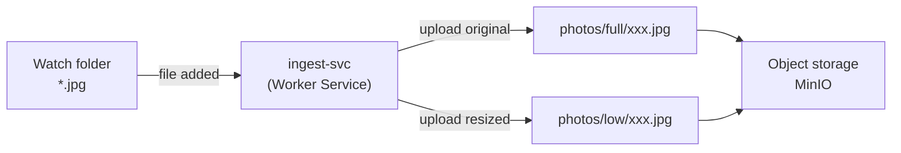

# ingest-svc

Cross-platform service that watches a folder for new `.jpg` files, generates a low-resolution copy, and uploads both versions to object storage (MinIO).

## Role in the architecture



## Requirements

- .NET 8 SDK — for local development
- Docker — for running via container
- MinIO bucket accessible on the network

## Configuration

Create an `appsettings.local.json` file at the root (not committed), or use environment variables with `__` as section separator (e.g. `Watcher__StandId=stand-1`):

```json
{
  "Logging": {
    "LogLevel": {
      "Default": "Information"
    }
  },
  "Watcher": {
    "Path": "/path/to/watch",
    "StandId": "stand-id-here",
    "ProcessedPath": "/path/to/processed",
    "FailedPath": "/path/to/failed"
  },
  "Resize": {
    "MaxWidth": 800,
    "MaxHeight": 800
  },
  "Storage": {
    "Endpoint": "localhost:9000",
    "AccessKey": "minioadmin",
    "SecretKey": "minioadmin",
    "UseSSL": false,
    "Bucket": "photos",
    "FullPrefix": "full",
    "LowPrefix": "low",
    "RetryInitialDelayMs": 1000,
    "RetryMaxDelayMs": 60000
  }
}
```

## Run with Docker

```bash
docker pull ghcr.io/association-ephemere/ingest-svc:latest
```

```bash
docker run \
  -e Watcher__Path=/data/watch \
  -e Watcher__StandId=stand-id-here \
  -e Watcher__ProcessedPath=/data/processed \
  -e Watcher__FailedPath=/data/failed \
  -e Storage__Endpoint=<minio-host>:9000 \
  -e Storage__AccessKey=<access-key> \
  -e Storage__SecretKey=<secret-key> \
  -e Storage__Bucket=photos \
  -v /path/to/watch:/data/watch \
  -v /path/to/processed:/data/processed \
  -v /path/to/failed:/data/failed \
  ghcr.io/association-ephemere/ingest-svc:latest
```

> On Windows with Docker Desktop, use `host.docker.internal` to reach MinIO running on the host machine.

## Run in development

```bash
dotnet run --project src/IngestSvc
```

## Run tests

```bash
dotnet test
```

## Contributing

See [CONTRIBUTING.md](CONTRIBUTING.md)
